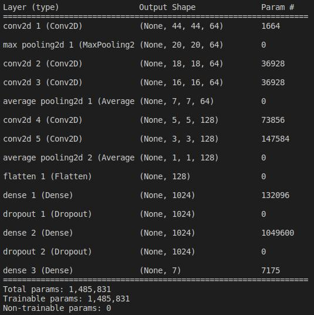
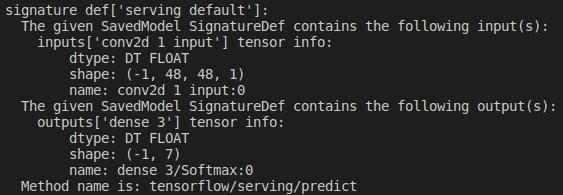

# Emotion Recognition

## Info
This repository contains machine learning model to recognise human facial expressions. Seven facial expressions can be detected:
+ angry
+ disgust
+ fear
+ happy
+ sad
+ surprise
+ neutral

## System design

graph LR
A[Webcam] -->B(OpenCV)
B --> C(Detect faces using Haar Cascade)
C --> D(Convert faces to 48px48p grayscale)
D --> E(Neural network)
E --> F{7-way softmax}
F -->|0| G[Angry]
F -->|1| H[Disgust]
F -->|2| I[Fear]
F -->|3| J[Happy]
F -->|4| K[Sad]
F -->|5| L[Surprise]
F -->|6| M[Neutral]


The system captures RGB images from the camera. Input image can be of any size greater than 48x48 pixels. A Haar Cascade is used to detect the faces in the image. Each detected face is cropped and converted to a grayscale image of size 48x48 pixel. The cropped faces are fed into the following neural network structure, which outputs the probability of each facial expression for each detected face.



The TensorFlow saved model signature is as follows:



## Instructions to run
1. First, clone the repository into your local machine
    ```bash
    $ git clone http://137.40.71.211/adaickalavan.meiyappan/emotion-recognition
    ```
1. Set the `ROOT` variable in `.env` file to point to the root directory of this repository. Set the `VIDEO` variable in `.env` file to the webcam port number. For example,
    ```.env
    ROOT = /home/user/go/src/137.40.71.211/emotion-recognition/
    VIDEO = 0
    ```
1. Install the necessary python libraries
    ```bash
    $ cd /path/to/project/root
    $ pip install -r requirements.txt
    ```     
1. Execute the program. Ensure that a webcam is fixed to your computer at the correct port. 
    ```
    $ python "/path/to/emotion-recognition/example/emoRecStream.py"
    ```
